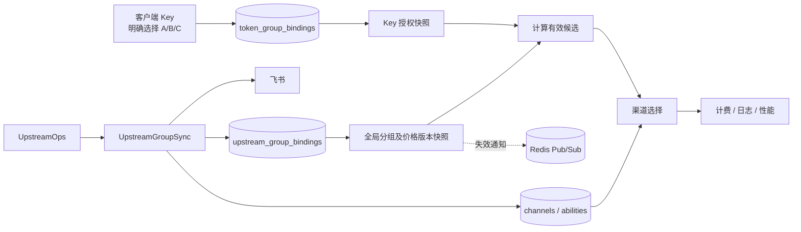
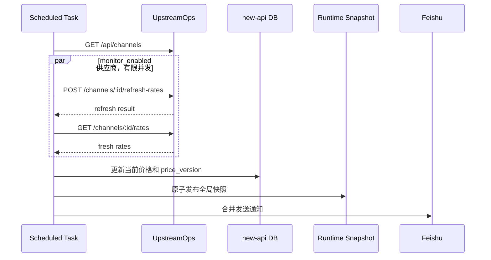

# UpstreamOps 多分组 Key、价格保护与渠道同步设计

> 状态：需求/设计评审稿
> 日期：2026-09-20
> 目标版本：new-api 当前主干 + UpstreamOps v0.0.9

## 🎯 1. 需求结论

本功能不是 AutoGroup，而是客户端 Key 自己持有一组明确的分组授权。

例如系统有 10 个可选分组，用户创建 Key K 时只选择 A、B、C：

- K 只能在 A、B、C 中路由，不继承全局 AutoGroup；
- A 价格变化后，只在 K 内将 A 判定为不可用；
- B、C 继续服务，A 对应的全局分组、渠道和 abilities 不因价格变化而禁用；
- 其他 Key 是否还能使用 A，取决于各自是否接受了 A 的当前价格版本；
- K 绝不回退到用户未选择的其余 7 个分组。

核心设计：

1. 新增标准化的 `token_group_bindings`，表达“客户端 Key 选择了哪些分组”。
2. 每条 Key-分组关联记录用户接受的价格版本，不把多分组伪装成 `group=auto`。
3. 上游价格变化时递增分组价格版本，不批量改写 Token，也不全局禁用渠道。
4. 只有“Key 内启用 + 已接受当前价格版本 + 分组全局可用”的关联才能进入路由。
5. 用户确认当前价格后，只更新该 Key 的该分组关联，其他 Key 不受影响。
6. 每个 UpstreamOps“供应商 + 分组”映射为独立的 new-api 本地分组和本地渠道。
7. 售价为 `ceil(上游倍率 × 1.18 × 1000) / 1000`，例如 `0.075 -> 0.089`。

## 📐 2. 对象与禁用边界

| 对象 | 含义 | 影响范围 |
| --- | --- | --- |
| Upstream 分组绑定 | 供应商分组与本地渠道的映射 | 全局资源 |
| 客户端 Key | 用户调用 new-api 的 Token | 单个 Key |
| 供应商 Key | new-api 调用供应商所用的 Key | 单个本地渠道 |
| Key-分组关联 | 客户端 Key 对分组的授权和价格确认 | 单个 Key × 单个分组 |
| 管理员全局禁用 | 管理员主动关闭一个接入分组 | 所有 Key |
| 价格失配 | Key 接受的价格版本落后 | 仅该 Key 中该分组 |

必须严格区分：

- 价格变化不等于全局分组故障；
- 价格变化时不修改本地渠道状态，不禁用 abilities；
- 用户在 Key 中关闭 A，只改变 K-A 关联；
- 管理员主动全局关闭 A 时才禁用渠道和 abilities；
- Redis 不是权限或价格确认状态的唯一事实来源。

## 📌 3. 已核实的 UpstreamOps 能力

UpstreamOps v0.0.9 可使用以下 API：

| 用途 | API |
| --- | --- |
| 供应商列表 | `GET /api/channels?page=1&page_size=-1` |
| 强制刷新倍率 | `POST /api/channels/:id/refresh-rates` |
| 读取倍率快照 | `GET /api/channels/:id/rates` |
| 读取可创建 Key 的分组 | `GET /api/channels/:id/api-keys/groups` |
| 查询供应商 Key | `GET /api/channels/:id/api-keys?page=1&page_size=...` |
| 创建供应商 Key | `POST /api/channels/:id/api-keys` |
| 获取指定 Key 完整值 | `POST /api/channels/:id/api-keys/:key_id/reveal` |

已确认约束：

- v0.0.9 已删除旧的 `/api/upstream-sync`，上述接口仍可用；
- `GET /rates` 只返回已保存快照，每轮应先 refresh，成功后再读取 rates；
- NewAPI 类型供应商用分组名标识，没有远端分组 ID；
- Sub2API 类型供应商提供 `remote_group_id`；
- Key 列表可能包含掩码或完整 Key，原始响应不得写日志、事件或通知。

## 🧭 4. 范围

本期包含：

- 每分钟同步供应商和分组倍率，单轮总超时 30 秒；
- 管理员选择接入哪些 Upstream 分组；
- 启用分组时检查、创建和 reveal 供应商 Key；
- 为每个接入分组创建独立渠道、分组和 abilities；
- 用户为客户端 Key 明确多选分组并排序；
- Key 级价格版本确认与动态过滤；
- 计费、日志、渠道性能和飞书通知接入。

本期不包含：

- AutoGroup 的全局继承；
- 自动替用户接受新价格；
- 按性能自动调价或排序；
- 自动删除供应商 Key；
- 修改 UpstreamOps；
- 合并多个供应商分组为一个本地分组。

## 🏗️ 5. 总体架构



有效候选集合：

```text
Key 明确选择的分组
∩ Key 内 enabled=true
∩ accepted_price_version=current_price_version
∩ 全局接入状态 active
∩ 当前用户有权使用
∩ 当前模型存在可用 ability
```

任何条件不满足都只排除该候选，绝不回退到 Key 未选择的分组。

## 🪪 6. 标识与命名

展示名按需求使用：

```text
渠道{upstream_channel_id}-{remote_group_name}
```

示例：`渠道5-【GPT】Pro`。用于渠道名称、Key 分组选择器、管理页、通知和管理员日志。

内部 `group` 不能直接使用远端名称，因为名称可能重名、超长或含逗号。建议：

```text
Sub2API: uo-{channel_id}-{remote_group_id}
NewAPI:  uo-{channel_id}-{sha256(remote_group_name)前12位}
```

- `uo-` 是同步模块管理的命名空间；
- 普通用户只看到展示名；
- NewAPI 分组改名按“旧分组消失 + 新分组出现”处理；
- 内部键不超过现有 `group` 字段长度。

## 🗃️ 7. 数据模型

使用关系表，不在 `tokens` 上保存 JSON 状态对象。字段采用 SQLite、MySQL 5.7.8+、PostgreSQL 9.6+ 兼容类型。

### 7.1 `upstream_group_bindings`

每行表示一个供应商分组的当前全局接入状态。

| 字段 | 类型建议 | 说明 |
| --- | --- | --- |
| `id` | GORM 主键 | 绑定 ID |
| `upstream_channel_id` | `bigint` | UpstreamOps 供应商 ID |
| `upstream_channel_name` | `varchar(128)` | 名称快照 |
| `upstream_channel_type` | `varchar(32)` | `newapi` / `sub2api` |
| `upstream_site_url` | `varchar(512)` | 供应商 Base URL |
| `remote_group_id` | `bigint nullable` | Sub2API 分组 ID |
| `remote_group_name` | `varchar(256)` | 远端分组名 |
| `local_group` | `varchar(64) unique` | 本地机器键 |
| `local_display_name` | `varchar(384)` | 展示名 |
| `local_channel_id` | `int nullable index` | 本地渠道 ID |
| `upstream_key_id` | `bigint nullable` | 远端 Key ID，不存明文 |
| `desired_enabled` | `bool` | 管理员是否启用接入 |
| `state` | `varchar(32)` | 全局接入状态 |
| `source_ratio` | `varchar(64)` | 当前上游原始倍率 |
| `sale_ratio` | `varchar(64)` | 当前售价倍率 |
| `price_version` | `bigint` | 每次价格变化时递增 |
| `disabled_reason` | `varchar(512)` | 全局不可用原因 |
| `last_seen_at` | `bigint` | 最近发现时间 |
| `last_synced_at` | `bigint` | 最近同步成功时间 |
| `created_time` / `updated_time` | `bigint` | 审计时间 |

全局状态：

```text
discovered       已发现，尚未接入
provisioning     正在准备供应商 Key 和本地渠道
active           全局可选择、可路由
admin_disabled   管理员主动全局关闭
group_removed    成功快照中已不存在
key_unavailable  供应商 Key 无法准备
error            接入过程失败
```

只有 `desired_enabled=true AND state=active` 才全局可用。

### 7.2 `token_group_bindings`

每行表示一个客户端 Key 对一个分组的明确授权。这是本功能的核心，不是 AutoGroup 配置。

| 字段 | 类型建议 | 说明 |
| --- | --- | --- |
| `id` | GORM 主键 | 关联 ID |
| `token_id` | `int index` | 客户端 Key ID |
| `binding_id` | `int index` | 上游分组绑定 ID |
| `position` | `int` | 用户保存的路由顺序 |
| `enabled` | `bool` | 用户是否在该 Key 内启用 |
| `accepted_price_version` | `bigint` | 用户最后接受的价格版本 |
| `accepted_source_ratio` | `varchar(64)` | 接受时原始倍率快照 |
| `accepted_sale_ratio` | `varchar(64)` | 接受时售价倍率快照 |
| `created_time` / `updated_time` | `bigint` | 审计时间 |

约束：

- 唯一索引 `(token_id, binding_id)`；
- 顺序索引 `(token_id, position)`；
- 删除客户端 Key 时由业务事务删除其关联，不依赖数据库 cascade；
- 接受版本必须来自同一事务内读取的当前分组版本。

关联状态由数据计算，不冗余持久化：

| 条件 | 状态 |
| --- | --- |
| `enabled=false` | `user_disabled` |
| 全局绑定非 active | `group_unavailable` |
| 接受版本小于当前版本 | `price_changed` |
| 版本一致且全局 active | `active` |

版本比较避免价格变化时批量更新 Token 或关联，也避免 Redis 丢数据后错误恢复。

### 7.3 `upstream_group_events`

记录全局事件，不保存任何 Key 明文。

| 字段 | 说明 |
| --- | --- |
| `binding_id` | 分组绑定 ID |
| `event_type` | `enabled`、`admin_disabled`、`price_changed`、`group_removed`、`key_created`、`sync_failed` |
| `old_state` / `new_state` | 全局状态变化 |
| `old_ratio` / `new_ratio` | 原始倍率变化 |
| `old_price_version` / `new_price_version` | 价格版本变化 |
| `affected_token_count` | 当时版本落后的 Key-分组关联数 |
| `message` | 脱敏摘要 |
| `created_time` | 事件时间 |

用户接受新价格属于单 Key 变更，写现有操作审计，不为每个 Key 生成全局事件。

## 💰 8. 定价与价格变化

```text
sale_ratio = ceil(source_ratio × 1.18 × 1000) / 1000
```

```text
0.075 × 1.18 = 0.0885
ceil(0.0885 × 1000) / 1000 = 0.089
```

实现要求：

- 使用项目已有 `github.com/shopspring/decimal`；
- 使用 Decimal `Equal` 判断倍率变化；
- 拒绝无法解析、小于等于 0、NaN、Inf 或超过管理上限的倍率；
- 保存规范十进制串；
- 涨价和降价都产生新版本；
- `0.1` 和 `0.10` 不产生新版本。

### 8.1 初次启用

管理员首次接入分组时保存当前原价和售价，设 `price_version=1` 并进入全局 `active`。用户之后把该分组加入 Key 时，关联接受版本写为 1。

### 8.2 价格变化事务

成功刷新发现倍率改变时：

1. 用 `lockForUpdate(tx)` 锁定绑定行并再次比较倍率；
2. 写入新 `source_ratio` 和新 `sale_ratio`；
3. `price_version = price_version + 1`；
4. 保持全局绑定 `active`；
5. 保持本地渠道和 abilities 启用；
6. 统计版本落后的已启用 Key-分组关联数；
7. 提交后发布快照失效通知并发送飞书通知。

明确不执行：

- 不把全局绑定设为 `price_changed`；
- 不禁用本地渠道或 abilities；
- 不更新 `tokens.group`；
- 不批量更新 `token_group_bindings`。

旧 Key 关联仍保存旧版本，运行时自然显示 `price_changed` 且 `effective_enabled=false`；新 Key 或已确认价格的 Key 可以继续使用该全局分组。

### 8.3 用户接受新价格

用户在 Key 内重新启用涨价分组时，只更新目标关联：

```text
enabled = true
accepted_price_version = current price_version
accepted_source_ratio = current source_ratio
accepted_sale_ratio = current sale_ratio
```

请求必须携带用户看到的 `price_version`。若提交时版本已变化，返回 409 并要求重新确认。

## 🔑 9. 两类 Key 生命周期

### 9.1 客户端 Key

创建请求示例：

```json
{
  "name": "production",
  "groups": [
    { "binding_id": 12, "enabled": true },
    { "binding_id": 18, "enabled": true },
    { "binding_id": 25, "enabled": true }
  ]
}
```

服务端在同一事务中：

1. 创建 `tokens`；
2. 校验三个分组全局 active 且用户有权选择；
3. 按请求顺序创建三条 `token_group_bindings`；
4. 写入各自当前价格版本与价格快照；
5. 不写 `group=auto`，不写 `auto_groups`，不继承全局 AutoGroup。

编辑 Key 时用完整目标集合做事务化替换：保留仍存在的关联、增加新关联、删除用户移除的关联，并重新编号 `position`。保存前再次校验价格版本。

### 9.2 旧 Key 兼容

- 没有关联的旧 Key 继续按现有 `Token.Group` 单分组语义运行；
- 有关联的新 Key 进入 Key 级多分组路径；
- 两种路径互斥，不自动转换历史 Key；
- `Token.AutoGroups` 只服务原有 AutoGroup，不作为本功能数据源；
- `uo-` 托管分组禁止写入旧 Key 的 `Token.Group` 或 `Token.AutoGroups`，防止绕过 Key-分组关联的价格版本校验；
- 本期不提供自动迁移。

### 9.3 供应商 Key

管理员全局启用供应商分组时：

1. 调用 groups API 验证分组仍存在；
2. 分页查询该供应商的 Key；
3. 查找目标分组下 active、未过期、无模型和 IP 限制的 Key；
4. 优先复用已记录的 `upstream_key_id`，否则选 ID 最小的合格 Key；
5. 不存在时创建 `new-api-managed-{local_group}`；
6. 调用 reveal 获取完整 Key；
7. 完整 Key 只写入 `channels.key`，绑定表只存远端 Key ID；
8. 日志、错误、事件和通知不得包含完整 Key。

全局禁用时不删除供应商 Key。再次启用时重新验证，失效则重新选择或创建。

## 🚦 10. 路由设计

### 10.1 请求上下文

鉴权后写入独立上下文，不使用 `ContextKeyTokenAutoGroups`：

```go
type TokenGroupRoute struct {
    BindingID            int
    LocalGroup           string
    Position             int
    AcceptedPriceVersion int64
    CurrentPriceVersion  int64
    SaleRatio            string
}
```

建议上下文键为 `ContextKeyTokenGroups`，只放本次请求的有效关联。

### 10.2 有效性过滤

`GetRequestTokenGroups` 按 `position` 检查：

1. 关联 `enabled=true`；
2. 全局绑定 active；
3. 接受版本等于当前版本；
4. 用户仍有分组权限；
5. 倍率和本地渠道映射有效。

过滤后为空返回稳定 503 `TOKEN_GROUP_UNAVAILABLE`，鉴权仍成功。响应不暴露供应商、成本或停用原因。

鉴权与渠道选择还必须拒绝通过请求参数、旧 `Token.Group`、AutoGroup、偏好渠道或 affinity 直接进入 `uo-` 分组。托管分组的唯一授权入口是当前 Token 自己的 `token_group_bindings`。

### 10.3 选择与重试

- 候选只来自该 Key 的关联，按 `position` 选择；
- 先耗尽当前分组的现有渠道优先级，再尝试下一个有效分组；
- 不读取全局 AutoGroup 列表；
- 不尝试 Key 未选择的分组；
- 偏好渠道和 affinity 命中前也必须验证其属于有效候选。

可以复用现有“有序候选重试”的内部算法，但 API、存储、权限和错误语义必须与 AutoGroup 分离。

### 10.4 并发价格变化

选中分组时把其 `accepted_sale_ratio` 和价格版本固定到请求上下文：

- 快照发布前已选中的在途请求按固定售价完成；
- 新快照发布后的请求会过滤旧版本关联；
- 结算阶段不得重新读取最新售价；
- 跨分组重试时同步切换目标分组的售价快照。

## 🔄 11. 一分钟同步

任务每 60 秒运行一次，单轮总超时 30 秒，使用现有系统任务租约保证集群中只有一个执行者。



规则：

1. 固定一分钟触发 `upstream_group_sync`。
2. 每轮一个 30 秒 `context.WithTimeout`，覆盖 HTTP 与数据库应用。
3. HTTP Transport 的连接、TLS、响应头读取也受超时控制。
4. 刷新全部 `monitor_enabled` 供应商，持续发现新分组。
5. 供应商间最大并发建议为 4；同一供应商严格先 refresh 后 rates。
6. refresh 失败时不读旧 rates 做价格判断。
7. 单供应商失败不阻断其他供应商。
8. 初次发现只创建 `discovered`，不自动建 Key 或渠道。
9. 只有成功刷新后的完整快照才能判断价格变化和分组消失。
10. 同轮通知按供应商合并。

同步失败保留上一次价格版本和全局状态，不把网络错误当成价格变化。

按需求读取以下配置，临时 Token 不写入代码、文档、数据库或日志：

```text
UPSTREAM_OPS_BASE_URL
UPSTREAM_OPS_TOKEN
UPSTREAM_GROUP_FEISHU_WEBHOOK
```

Base URL 去除尾部 `/`，Token 只进入 `Authorization: Bearer ...`。

## 🧰 12. 全局接入与 Key 内启停

### 12.1 管理员全局启用

1. 校验供应商 `monitor_enabled=true` 且分组存在。
2. 全局绑定进入 `provisioning`。
3. 检查、创建并 reveal 供应商 Key。
4. 创建或更新独立本地渠道：类型映射为 NewAPI/Sub2API，名称为展示名，`Group=local_group`，Tag 为 `upstream-ops-managed`。
5. 使用供应商 Key 请求 `/v1/models`，失败或为空则不发布。
6. 写入渠道模型和 abilities。
7. 保存当前价格，首次启用时版本为 1。
8. 同一事务中启用渠道、abilities 和全局绑定。
9. 提交后刷新渠道缓存和全局快照。

### 12.2 管理员全局禁用

只有管理员明确关闭接入时才：

1. 设置 `desired_enabled=false`、`state=admin_disabled`；
2. 禁用本地渠道和 abilities；
3. 从全局可选快照移除；
4. 保留全部 Key-分组关联，便于展示和恢复。

### 12.3 用户在 Key 内禁用

用户关闭 Key K 内的 A 时只更新目标关联的 `enabled=false`。不修改全局绑定、渠道、abilities，也不影响其他 Key。

## 🧠 13. Redis 与缓存

Key-分组授权和价格版本是权限、计费状态，必须保存在数据库。

| 存储 | 职责 |
| --- | --- |
| 主数据库 | 全局绑定、当前价格版本、Key 授权和接受版本的唯一事实来源 |
| 进程内全局快照 | `binding_id -> state/version/ratio/channel` |
| Token 缓存 | Key 的有序关联及接受版本 |
| Redis | Token 编辑后的缓存失效；价格版本更新后的多节点通知 |

价格变化无需失效全部 Token 缓存：请求时比较 Token 缓存中的接受版本与全局快照版本。Redis 消息只含 binding ID 和新版本，不含价格详情、Token、供应商 Key 或 Webhook。

Redis 不可用时数据库仍是真相；同步节点立即更新本机快照，其他节点通过周期加载最终刷新。Redis 键丢失绝不能使旧版本被视为已接受。

## 🧾 14. 计费、日志与性能

### 14.1 计费

- 使用最终选中关联的 `accepted_sale_ratio`；
- 倍率与 `local_group` 一起固定在请求上下文；
- 预扣费和结算使用同一快照；
- 结算不得重新读取最新价格；
- 托管分组不再套用会绕过统一 18% 规则的 `GroupGroupRatio` 特价；
- 用户接受新版本后，后续请求才使用新售价。

### 14.2 消费日志

- `Log.Group = local_group`；
- `Log.ChannelId = local_channel_id`；
- `Other.group_ratio = accepted_sale_ratio`；
- 模型价格、倍率和 token 数保持现有语义。

管理员可见的 `other.admin_info` 增加 binding ID、上游渠道 ID、远端分组、价格版本、原价和售价。普通用户日志继续剥离 `admin_info`。

历史日志保存请求发生时的实际倍率，价格更新不得回算或改写历史。

### 14.3 渠道性能

- 每个供应商分组是独立本地渠道，可分别统计成功率、延迟、TTFT、TPS 和缓存命中率；
- 某 Key 因价格失配不再使用 A，不影响其他已接受当前价格的 Key 为 A 产生样本；
- 只有全局禁用或远端分组消失后，A 才停止所有新样本；
- Key 编辑页显示该 Key 接受的售价和分组当前售价。

## 🖥️ 15. 页面设计

### 15.1 Upstream 分组管理页

按供应商展示分组名、原价、售价、价格版本、受影响 Key 数、供应商 Key 状态、本地渠道、同步时间和全局接入操作。

价格变化是版本事件，不提供“全局接受后恢复所有 Key”的按钮，因为接受价格属于每个 Key。

### 15.2 客户端 Key 页面

新增独立的分组多选控件，不放入 AutoGroup 模式：

- 系统有 10 个分组时，用户可只选 3 个；
- 支持保存顺序；
- 每项显示当前售价；
- 版本落后时显示 `price_changed`，且不参与路由；
- Key 详情 API 对版本落后的关联返回 `effective_enabled=false`，明确表达“该 Key 内已禁用”，但保留用户原始选择和接受价格快照；
- 用户确认当前售价后，只更新此 Key 的关联；
- 全局不可用的历史选择仍展示，但不可重新启用；
- 前后端共同校验最大选择数量。

新增文案进入 en、zh、zh-TW、fr、ja、ru、vi 七种 locale。

## 🔔 16. 飞书通知

通知事件：价格变化、远端分组消失、provisioning 或供应商 Key 创建失败、同步由正常转失败及恢复。

价格变化通知包含供应商、分组、旧/新原价、旧/新售价、旧/新版本、受影响 Key 数和发现时间。文案必须说明“旧价格版本 Key 中该分组不可路由”，不能写成“全局渠道已禁用”。

- 同轮按供应商合并；
- 数据库先提交，再发送通知；
- 通知失败不回滚版本更新；
- Webhook、Authorization 和供应商 Key 不进入日志或响应。

## 🔌 17. API 设计

### 17.1 管理 API

| 方法 | 路径 | 用途 |
| --- | --- | --- |
| `GET` | `/api/upstream-groups` | 查询分组、价格版本和全局状态 |
| `POST` | `/api/upstream-groups/sync` | 手动同步 |
| `POST` | `/api/upstream-groups/:id/enable` | 准备 Key、渠道和 abilities 并全局接入 |
| `POST` | `/api/upstream-groups/:id/disable` | 管理员全局禁用 |
| `GET` | `/api/upstream-groups/:id/events` | 查询状态和价格事件 |

写接口接入现有 Admin/Root 权限、CriticalRateLimit、SecureVerificationRequired 和审计。

### 17.2 用户 Key API

| 方法 | 路径 | 用途 |
| --- | --- | --- |
| `GET` | `/api/token/groups` | 返回当前用户可选的全部 active 分组 |
| `POST` | `/api/token/` | 创建 Key 并提交明确的 `groups` |
| `PUT` | `/api/token/` | 编辑 Key 的分组集合和顺序 |
| `POST` | `/api/token/:id/groups/:binding_id/accept-price` | 仅为该 Key 接受当前价格 |
| `POST` | `/api/token/:id/groups/:binding_id/disable` | 仅在该 Key 内禁用分组 |

`GET /api/token/groups` 不返回全局 AutoGroup 继承列表。示例：

```json
{
  "groups": [
    {
      "binding_id": 12,
      "value": "uo-5-8",
      "label": "渠道5-【GPT】Pro",
      "price_version": 4,
      "sale_ratio": "0.090"
    }
  ],
  "max_count": 20
}
```

接受价格接口校验 Token 所有权，并要求携带用户所见 `price_version`。

## 🛡️ 18. 安全要求

- 临时 Token 不写入仓库、文档、数据库或日志；
- 不修改或提交 `.env`；
- UpstreamOps Client 使用独立 Transport，Authorization 不透传到供应商；
- API DTO 明确列字段，不返回远端原始 JSON；
- 完整供应商 Key 只进入现有 `channels.key` 敏感字段；
- 列表、审计和通知统一掩码；
- 同步 URL 只来自固定配置，不接受请求参数覆盖；
- 供应商 Base URL 做 HTTPS 与 SSRF 边界校验；
- 响应体设置大小上限；
- 错误不得包含请求 Header、Token、Key 或 Webhook。

## ⚠️ 19. 失败语义

| 场景 | 行为 |
| --- | --- |
| UpstreamOps 配置缺失 | 不启动同步，不改变已有状态 |
| 飞书配置缺失 | 同步和版本更新正常，通知标记未配置 |
| 30 秒超时 | 未成功刷新的供应商不判断价格或消失 |
| refresh `{ok:false}` | 不读取旧倍率做判断 |
| 非法倍率 | 不发布新版本，记录错误并通知管理员 |
| 价格变化 | 更新全局价格和版本；旧版本 Key 内该分组失效；渠道保持启用 |
| 用户接受价格 | 只更新该 Key 的目标关联 |
| 管理员全局禁用 | 所有 Key 过滤该分组，关联保持不变 |
| Key 只选 A 且 A 失配 | 返回 `TOKEN_GROUP_UNAVAILABLE`，不回退 |
| Key 选 A/B/C 且 A 失配 | 只在 B/C 中路由 |
| Redis 不可用 | 以数据库和本机快照为准，不恢复旧授权 |
| 已有在途请求 | 按请求开始时固定售价结算 |

## 🧪 20. 测试与验收

### 20.1 后端测试

1. `0.075 × 1.18` 精确得到 `0.089`。
2. `0.1` 与 `0.10` 不递增版本。
3. 价格变化只更新倍率和版本，不改变渠道/abilities。
4. 价格变化不更新 Token 和 Key-分组关联行。
5. 接受版本落后的关联被过滤。
6. K 选择 A/B/C，A 变化后只返回 B/C。
7. 已接受 A 当前版本的其他 Key 仍可使用 A。
8. K 接受 A 新版本后恢复 A，其他关联不变。
9. 所有已选组无效时返回稳定 503，不越权回退。
10. 旧单分组 Key 继续按 `Token.Group` 工作。
11. 新多分组 Key 不读取 AutoGroup。
12. 旧 `Token.Group`、AutoGroup、请求参数、affinity 和跨分组重试均不能绕过 Key 候选进入 `uo-` 分组。
13. 计费和日志使用最终关联的售价快照。
14. 同步失败不递增版本，成功变化只递增一次。
15. enable 重试不重复创建本地渠道或供应商 Key。

新 Go 测试使用 `require` 做前置和致命断言，使用 `assert` 比较结果。

### 20.2 数据库与契约测试

SQLite、MySQL、PostgreSQL 验证迁移、唯一约束、`lockForUpdate` 并发版本更新、Key 与关联同事务、单关联接受价格，以及全局启停时渠道/abilities 一致性。

使用 `httptest.Server` 覆盖 UpstreamOps 的 channels、refresh、rates、groups、Key list/create/reveal，以及 401、403、429、5xx、`ok:false`、超时、截断 JSON 和超大响应。自动测试不得访问真实地址或使用真实 Token。

### 20.3 前端测试

- 系统 10 组时只选 3 组；
- 编辑页不混入全局 AutoGroup；
- `active`、`price_changed`、`group_unavailable`、`user_disabled` 状态正确；
- 接受价格显示当前版本和售价；
- 409 后刷新并重新确认；
- 顺序、上限、键盘操作和七种语言完整。

### 20.4 核心验收场景

```text
Given  系统有 A-J 共 10 个全局 active 分组
And    Key K 只选择 A、B、C
And    K 对三组接受的价格版本均为 7
When   同步发现 A 的原价从 0.075 变为 0.076
Then   A 的全局价格版本从 7 变为 8
And    A 的当前售价变为 0.090
And    A 的本地渠道和 abilities 仍为 enabled
And    K 的关联仍保存 A/B/C，A 的接受版本仍为 7
And    K 的有效候选只有 B、C
And    K 绝不会路由到 D-J
And    已接受 A 版本 8 的其他 Key 仍可路由 A
And    飞书说明旧版本 Key 受影响，而非全局渠道停用

When   K 的所有者确认 A 的版本 8
Then   只把 K-A 的接受版本更新为 8
And    K 的有效候选恢复为 A、B、C
And    其他 Key 不发生变化
```

## 🚀 21. 实施顺序与验证

1. 新增全局绑定、Key-分组关联、事件表和 Decimal 定价函数
   验证：三数据库迁移、约束、定价和并发版本测试。
2. 实现 UpstreamOps Client 与一分钟同步任务
   验证：mock 契约、30 秒取消、版本只递增一次、日志脱敏。
3. 实现供应商 Key 和本地渠道 provisioning
   验证：启停幂等、渠道/abilities 一致、模型失败不发布。
4. 实现 Key `groups` API、事务写入和缓存
   验证：10 选 3、顺序、所有权和旧 Key 兼容。
5. 实现 `GetRequestTokenGroups`、渠道选择和重试
   验证：A 涨价只用 B/C，绝不回退 D-J，affinity 不绕过。
6. 接入请求级售价、日志、价格和性能
   验证：预扣结算一致、历史日志不变、指标归属正确。
7. 实现页面、飞书和审计
   验证：状态、409、通知语义、i18n、构建和视觉检查。
8. 灰度上线
   验证：先发现，再接入一组；创建 10 选 3 Key；模拟涨价并核对全链路。

## ↩️ 22. 回滚

1. 停止同步任务。
2. 管理员全局禁用 `uo-` 绑定，并禁用对应渠道/abilities。
3. 清空进程内托管快照并刷新渠道缓存。
4. 保留新表、本地渠道、供应商 Key ID、Key-分组关联和事件。
5. 旧单分组 Key 与非托管渠道不受影响。

回滚不删除用户选择。重新启用时仍按当前价格版本判断每个 Key 是否可用。

## ✅ 23. 最终验收标准

- 系统有 10 个分组时，用户可为 Key 明确选择其中 3 个。
- 新多分组 Key 不使用 `group=auto`、`auto_groups` 或全局 AutoGroup 继承。
- 价格变化只使旧版本 Key-分组关联失效，不全局禁用分组、渠道或 abilities。
- 同一分组可被已接受当前价格的 Key 使用，同时被旧版本 Key 排除。
- 用户接受价格时只修改目标 Key 的目标分组关联。
- 管理员全局禁用与 Key 内禁用是两个独立操作。
- 请求绝不回退到 Key 未选择的分组。
- `0.075` 的售价严格为 `0.089`。
- 一分钟同步、30 秒总超时和飞书合并通知生效。
- 计费、日志和性能归属于实际分组、渠道及请求开始时的价格版本。
- Redis 故障不会恢复旧价格授权。
- 敏感 Token、Webhook 和供应商 Key 不进入代码、文档、事件、API 响应或日志。
- SQLite、MySQL、PostgreSQL 均通过迁移与核心行为测试。
